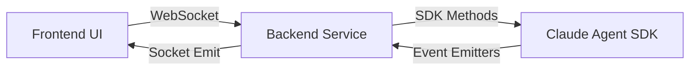

# Tiêu chuẩn Tích hợp Claude Agent SDK

Tài liệu này quy định kiến trúc và tiêu chuẩn kỹ thuật khi sử dụng `@anthropic-ai/claude-agent-sdk` trong dự án Claude-Web.

---

## 1. Triết lý Tích hợp (Integration Philosophy)

Dự án Claude-Web tuân thủ nguyên tắc **"UI là lớp vỏ, SDK là bộ não"**:
*   **Lợi dụng tối đa Tự động hóa**: Sử dụng các tính năng thông minh của SDK như `permissionMode: 'auto'`, nén context tự động và lập kế hoạch thực hiện.
*   **Đơn giản hóa Backend**: Hạn chế tối đa việc can thiệp vào luồng suy luận của Claude. Backend chỉ đóng vai trò là trạm trung chuyển (proxy) sự kiện giữa SDK và WebSocket.
*   **Tin tưởng SDK**: Mọi logic về việc chọn tool, lập kế hoạch thực hiện, và quản lý lịch sử hội thoại phải được giao phó hoàn toàn cho SDK.

## 2. Kiến trúc Tổng thể (Architecture)

Quy trình tương tác phải tuân thủ mô hình sự kiện (event-driven):

*   **Nguyên tắc**: Không bao giờ gọi trực tiếp CLI thô (spawn) trừ khi SDK không hỗ trợ.
*   **Tham vấn MCP**: Khi làm việc với `@anthropic-ai/claude-agent-sdk`, bắt buộc phải hỏi `mcp context7` để đảm bảo sử dụng đúng các phương thức và flow mới nhất.
*   **Duy trì trạng thái**: Mỗi `sessionId` tương ứng với một Instance của Agent trong bộ nhớ Backend.

## 2. Quản lý Vòng đời (Lifecycle Management)

### 2.1 Khởi tạo (Initialization)
*   **Storage Path**: Luôn chỉ định `storagePath` trỏ tới `~/.claude/projects/` để đồng bộ với CLI chính thức.
*   **Session ID**: Phải sử dụng ID duy nhất (thường là tên folder dự án hoặc UUID) để tránh ghi đè dữ liệu.

### 2.2 Cơ chế Watchdog
*   Mọi Agent Instance phải có `timeout` tối đa cho một yêu cầu (ví dụ: 5 phút).
*   Khi WebSocket disconnect, backend phải kiểm tra và dọn dẹp các tiến trình còn treo.

## 3. Đường ống Sự kiện (Event Pipeline)

Mọi sự kiện từ SDK phải được bọc lại (wrapper) trước khi gửi về Frontend:

| SDK Event | Mục đích | Dữ liệu trả về (Payload) |
| :--- | :--- | :--- |
| `onText` | Text stream thô | `{ type: 'text', content: string }` |
| `onToolCall` | Yêu cầu chạy tool | `{ type: 'tool_call', tool: string, args: any, id: string }` |
| `onSubagentStart` | Agent con bắt đầu | `{ type: 'agent_start', name: string, purpose: string }` |
| `onError` | Lỗi thực thi | `{ type: 'error', message: string, code: string }` |

## 4. Quy trình Phê duyệt (Approval Workflow)

Đối với các Tool nhạy cảm (`bash`, `write_file`):

1.  **Tạm dừng**: Backend chặn luồng xử lý của SDK bằng một `Promise` chưa resolve.
2.  **Yêu cầu**: Gửi event `PERMISSION_REQUEST` về UI.
3.  **Phản hồi**: 
    *   Nếu người dùng `Approve`: Resolve Promise với kết quả cho phép.
    *   Nếu người dùng `Reject`: Reject Promise hoặc gửi kết quả lỗi cho Agent.
4.  **Timeout**: Nếu quá 60s không có phản hồi, tự động hủy lệnh để tránh treo tài nguyên.

## 5. Lưu trữ và Đồng bộ (Persistence)

*   **Database First**: Thông tin về Sub-agent và Tool Call phải được lưu vào bảng `chat_messages` (cột `blocks`) ngay khi nhận được từ SDK.
*   **Metadata**: Lưu trữ đầy đủ `agent_result` để hiển thị lại lịch sử chính xác mà không cần gọi lại SDK.

## 6. Xử lý Lỗi và Hồi phục

*   **Graceful Shutdown**: Khi gặp lỗi nghiêm trọng, phải đóng SDK instance một cách sạch sẽ bằng `agent.terminate()`.
*   **User Feedback**: Không hiển thị thông báo lỗi hệ thống thô (như stack trace). Phải chuyển ngữ sang Tiếng Việt dễ hiểu.

---
> [!IMPORTANT]
> Việc vi phạm các tiêu chuẩn này sẽ dẫn đến lỗi treo tiến trình (zombie process) và mất đồng bộ dữ liệu với bản CLI gốc.
